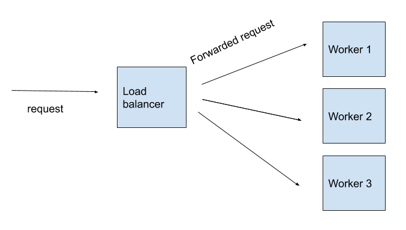

# PROGJAR_FP
Repositori untuk Final Project mata kuliah Pemrograman Jaringan

## Soal
Dalam sebuah sistem yang melayani banyak request, terkadang sebuah server tidak mampu melayani, diperlukan mekanisme sistem terdistribusi agar beban dan request dapat dilayani secara berbagi oleh worker yang ada.

* Buatlah sistem seperti pada gambar di atas, untuk melayani request dalam jumlah besar.
* Buatlah tabel eksperimen yang menunjukan kemampuan sistem anda dalam melayani request yang besar dan juga konkurensi yang banyak.
    * Model processing server (asynchronous / thread based) ditentukan oleh kelompok.
    * Diperbolehkan teknik-teknik yang memungkinkan worker bisa bertambah secara otomatis jika dibutuhkan
* Buatlah juga sebuah video penjelasan yang memperlihat langkah-langkah menjalankan program, percobaan penambahan worker otomatis jika dibutuhkan, dan juga dalam video diberi penjelasan singkat code yang dibuat.
* Buat laporan dalam bentuk PDF yang berisi penjelasan mengenai code, model processing server, mekanisme penambahan worker otomatis jika dibutuhkan, dan hasil tabel eksperimen dilengkapi dengan kesimpulan dari hasil percobaan.

## Kelompok
| Nama | NRP |
|------|-----|
| Zidan Lutfi | 051111740000007 |
| Ersad Ahmad Ishlahuddin | 051111740000016 |
| Ananta Dwi Prasetya Purna Yuda | 051111740000029 |
| Anggar Wahyu Nur Wibowo | 051111740000052 |